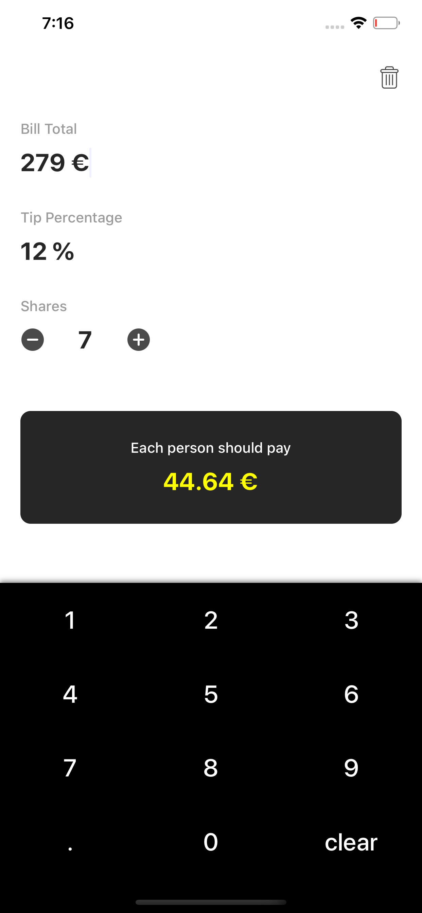

# AllaRomana

This a simple tips calculator app that was designed with the idea of doing a fully custom keyboard using a `UICollectionView`.

It uses the `MVVM` architecture provided by [BloodyMary](https://github.com/TheInkedEngineer/BloodyMary)

## UI

Below is a screenshot of the fully compiled calculator with the custom keyboard open

